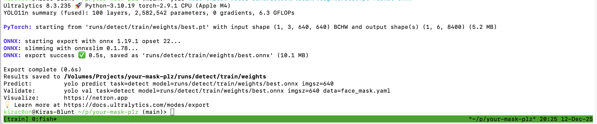

# Your Mask Plz

**Deep Learning Course Final Project**

**深度学习课程 大作业**

A lightweight, real-time face mask detection application, local deployment. Native support Mac Mini M4, MacOS 26.0.1

一个轻量级、实时的面部口罩检测应用，本地部署。原生支持 Mac Mini M4，MacOS 26.0.1
- YOLOv11n (Nano): lightweight, delivering high-speed inference, without requiring CUDA support...
	
	YOLOv11n (Nano)：轻量级，提供高速推理，无需 CUDA 支持...

- Streamlit: seamless Python integration, user-friendly to visualize deep learning results instantly.

	Streamlit：无缝的 Python 集成，便于用户即时可视化深度学习结果。

## Training

- Get dataset (From Kaggle):
	```zsh
	chmod +x get_dataset.sh
	sh ./get_dataset.sh
	```
- Install env (Python 3.10):
	```zsh
	pip install "ultralytics>=8.3" opencv-python streamlit
	```
- Train (YOLOv11n baseline, adjust epochs/batch as needed):
	```zsh
	yolo task=detect mode=train model=yolo11n.pt data=face_mask.yaml epochs=100 imgsz=640 batch=16 lr0=0.01 warmup_epochs=3 cos_lr=True
	```
- Evaluate:
	```zsh
	yolo mode=val model=runs/detect/train4/weights/best.pt data=face_mask.yaml
	```
- Quick predict check:
	```zsh
	yolo mode=predict model=runs/detect/train4/weights/best.pt source=dataset/images/valid save=True
	```
- Export (for deploy):
	```zsh
	yolo mode=export model=runs/detect/train4/weights/best.pt format=onnx
	```


---

## 训练流程

- 获取数据集 (From Kaggle)：
	```zsh
	chmod +x get_dataset.sh
	sh ./get_dataset.sh
	```
- 数据描述文件：
	```yaml
	path: dataset/images
	train: train
	val: valid
	test: test
	names: [no_mask, mask]
	```
- 环境安装（Python 3.10）：
	```zsh
	pip install "ultralytics>=8.3" opencv-python streamlit
	```
- 训练（YOLOv11n 基线，按需调整 epoch/batch）：
	```zsh
	yolo task=detect mode=train model=yolo11n.pt data=face_mask.yaml epochs=100 imgsz=640 batch=16 lr0=0.01 warmup_epochs=3 cos_lr=True
	```
- 评估：
	```zsh
	yolo mode=val model=runs/detect/train/weights/best.pt data=face_mask.yaml
	```
- 推理自检：
	```zsh
	yolo mode=predict model=runs/detect/train/weights/best.pt source=dataset/images/valid save=True
	```
- 导出（便于部署）：
	```zsh
	yolo mode=export model=runs/detect/train/weights/best.pt format=onnx
	```