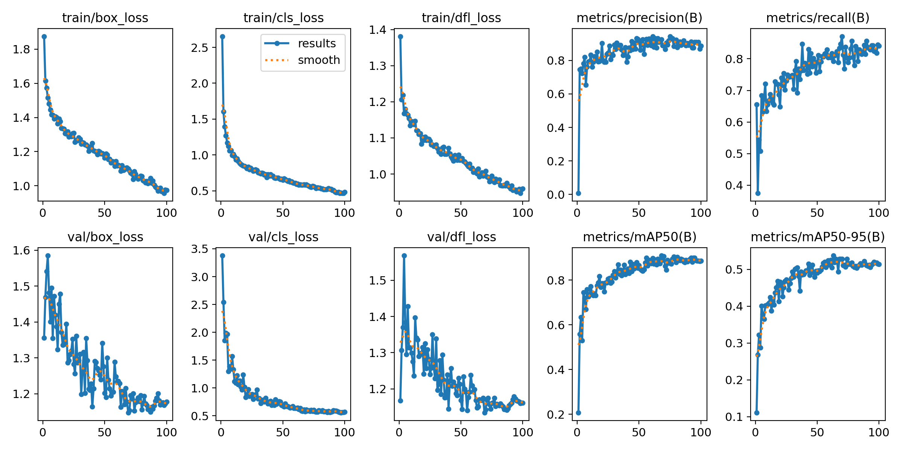
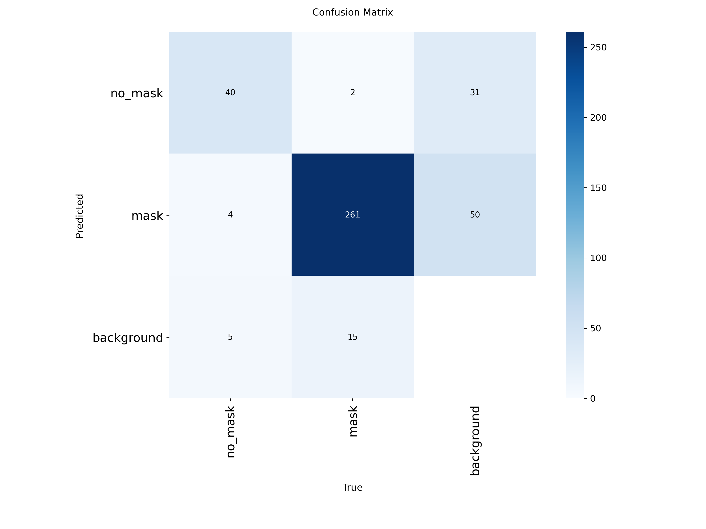
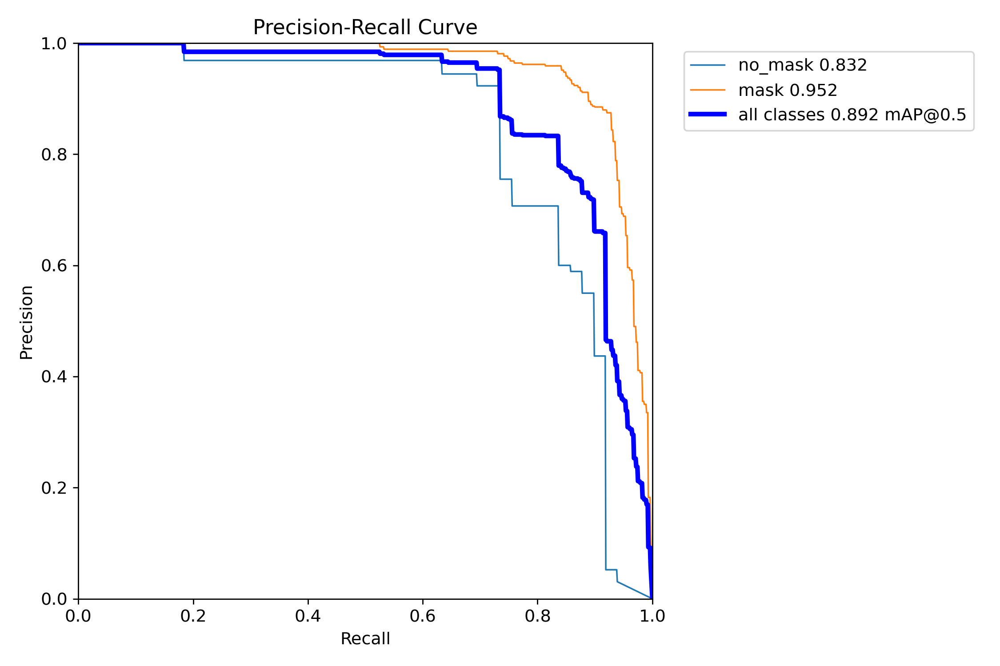
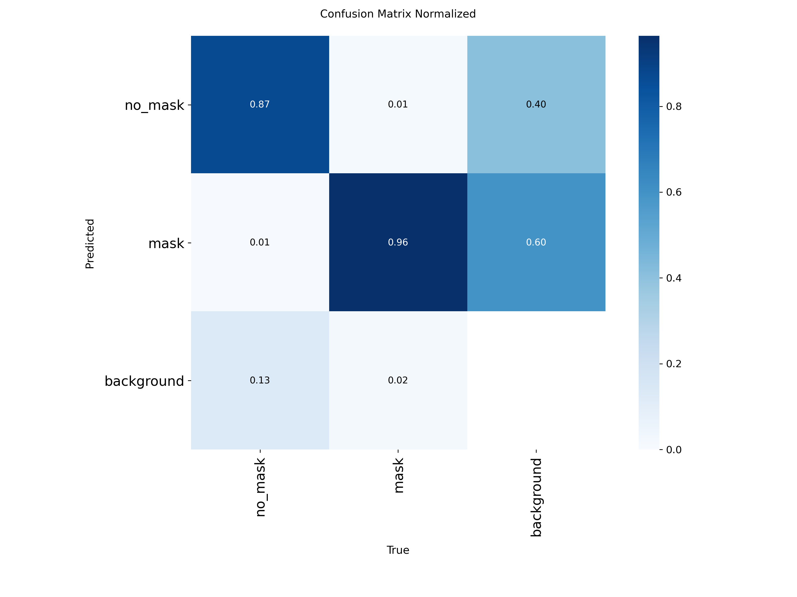
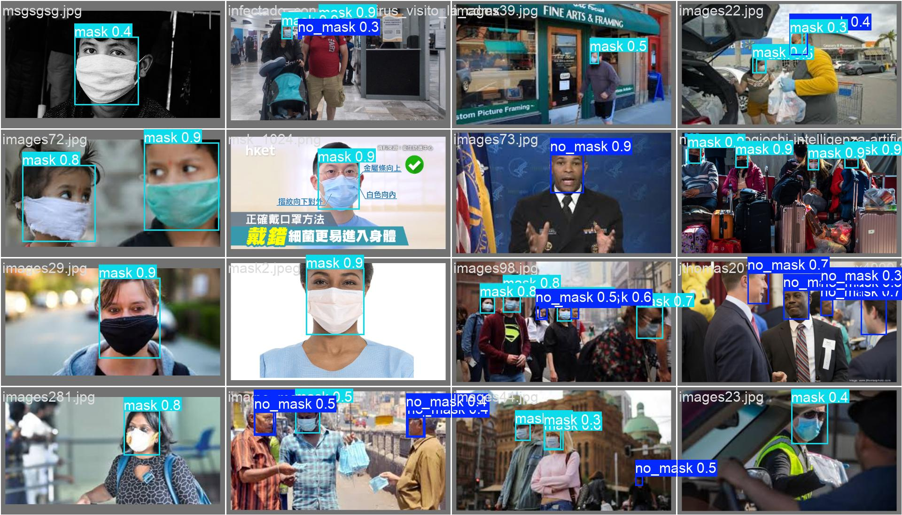

# Your Mask Plz - 口罩检测系统测试报告

## 1. 项目概述 (Project Overview)

基于深度学习的口罩检测系统的设计、实现和评估结果。该系统包括两个核心部分：**AI 检测模型**和**交互式应用程序**。

**系统目标**：准确、实时地检测图像和视频中的人物是否佩戴口罩，并通过友好的 Web 界面提供即时反馈。

**技术栈**：
- **深度学习框架**: YOLOv11n (轻量级目标检测模型)
- **推理引擎**: ONNX Runtime (跨平台优化推理)
- **应用框架**: Streamlit (Python Web 应用)
- **图像处理**: OpenCV, Pillow
- **目标硬件**: Mac Mini M4, macOS 26.0.1 (原生支持)

## 2. 实验设置 (Experimental Setup)

### 2.1 数据集 (Dataset)
数据集分为训练集、验证集和测试集。
- **类别 (Classes)**: `no_mask` (未戴口罩), `mask` (戴口罩)
- **数据来源**: 数据集包含多种场景，如公共交通、机场和街道场景等。

### 2.2 模型配置 (Model Configuration)
- **模型架构**: YOLOv11n (Nano variant - 轻量级版本)
- **输入尺寸**: 640×640 (动态调整)
- **训练轮数**: 100 epochs
- **批次大小**: 16
- **学习率**: 初始 0.01，余弦退火策略
- **预热轮数**: 3 epochs
- **优化器**: AdamW (YOLO 默认配置)
- **数据增强**: 自动应用 (包括 Mosaic, MixUp, 随机翻转等)
- **导出格式**: ONNX (优化 CPU 推理性能)

## 3. 定量结果 (Quantitative Results - Validation)

模型在训练 100 轮后在验证集上进行了评估。关键指标总结如下：

| 指标 (Metric) | 数值 (Value) | 描述 (Description) |
| :--- | :--- | :--- |
| **精确率 (Precision B)** | 0.886 | 正类预测的准确性。 |
| **召回率 (Recall B)** | 0.841 | 模型发现所有正类实例的能力。 |
| **mAP50 (B)** | 0.886 | IoU 阈值为 0.50 时的平均精度均值。 |
| **mAP50-95 (B)** | 0.514 | IoU 阈值从 0.50 到 0.95 的平均精度均值。 |

### 3.1 损失分析 (Loss Analysis)
训练过程显示损失值持续下降，表明学习有效：
- **框损失 (Box Loss)**: 降至约 1.18 (验证集)
- **分类损失 (Class Loss)**: 降至约 0.57 (验证集)
- **DFL 损失 (DFL Loss)**: 降至约 1.16 (验证集)



### 3.2 混淆矩阵与曲线 (Confusion Matrix & Curves)
评估生成了多个关键图表（已整理至 `report_figures/` 目录）：
- **混淆矩阵 (Confusion Matrix)**: 展示 `mask` 和 `no_mask` 类别之间的分类准确度。
- **F1-置信度曲线 (F1-Confidence Curve)**: 展示不同置信度阈值下精确率和召回率之间的权衡。
- **精确率-召回率曲线 (Precision-Recall Curve)**: 展示模型在不同阈值下的性能。




### 3.3 测试集结果 (Test Set Results)
为了验证模型的泛化能力，我在独立的测试集 (`split='test'`) 上进行了评估。测试集包含 120 张图像和 659 个实例。

| 类别 (Class) | 图片数 (Images) | 实例数 (Instances) | 精确率 (Precision) | 召回率 (Recall) | mAP50 | mAP50-95 |
| :--- | :--- | :--- | :--- | :--- | :--- | :--- |
| **总体 (All)** | 120 | 659 | 0.869 | 0.861 | 0.894 | 0.560 |
| **no_mask** | 46 | 156 | 0.826 | 0.790 | 0.819 | 0.451 |
| **mask** | 104 | 503 | 0.912 | 0.932 | 0.968 | 0.669 |



**分析**:
- 模型在测试集上的表现 (mAP50 89.4%) 略优于验证集 (mAP50 88.6%)，这表明模型没有过拟合，且具有良好的泛化能力。
- `mask` 类别的检测效果显著优于 `no_mask` 类别 (mAP50: 96.8% vs 81.9%)。这可能是因为 `no_mask` 的特征（人脸多样性）比口罩特征更复杂。

### 3.4 预测样本示例 (Prediction Samples)
以下展示了模型在验证集/测试集上的实际检测效果：



## 4. 定性结果 (Qualitative Results)

我在多样化的真实场景中测试了模型的检测能力。测试场景包括：
- **人群密集场所**: 公交站、机场等多人场景
- **单人特写**: 不同角度、不同光照条件下的人脸
- **复杂背景**: 各种室内外环境

### 观察结果 (Observations)
- 模型在单人和人群场景中均表现出稳健的检测能力
- 在大多数场景下，能够成功区分戴口罩和未戴口罩的人脸
- 对于部分遮挡、侧脸等困难样本也有较好的检测效果

## 5. 软件系统实现 (Software System Implementation)

### 5.1 系统架构 (System Architecture)

```
app.py (Entry Point)
    ├── src/config.py          # 配置常量 (置信度阈值、模型路径、帧步长限制)
    ├── src/i18n.py            # 双语支持 (英文/中文)
    ├── src/pipeline.py        # 核心推理管线 (图像预处理、模型推理、结果聚合)
    ├── src/services/
    │   └── model_loader.py    # 模型加载服务 (缓存、错误处理)
    └── src/ui/
        ├── image_flow.py      # 图像检测流程 UI
        └── video_flow.py      # 视频检测流程 UI (包含状态管理)
```

**设计原则**:
- **单一职责**: 每个模块只负责一个特定功能
- **依赖注入**: UI 层通过参数接收模型和配置
- **缓存优化**: 使用 `@st.cache_resource` 避免重复加载模型
- **状态管理**: 视频流使用 `st.session_state` 持久化处理结果

### 5.2 核心功能特性 (Core Features)

#### 5.2.1 图像检测流程
- **上传支持**: JPG, JPEG, PNG 格式
- **自适应分辨率**: 根据输入图像尺寸动态选择推理分辨率 (640/768/960)
- **实时可视化**: 两列布局展示原图和检测结果
- **检测统计**: 实时显示检测到的对象数量和类别分布

#### 5.2.2 视频检测流程
- **视频格式**: 支持 MP4, MOV, AVI
- **帧跳过策略**: 可配置帧步长 (1-5)，平衡处理速度与覆盖率
- **进度跟踪**: 实时进度条显示处理状态
- **结果回放**: 处理完成后可通过滑块浏览所有检测帧
- **累计统计**: 显示整个视频的检测对象累计数量

#### 5.2.3 双语界面
- **语言切换**: 英文 ↔ 中文无缝切换
- **集中管理**: 所有文本存储在 `TEXT` 字典中，易于维护和扩展
- **格式化支持**: 动态文本插值 (如显示检测数量、文件路径等)

### 5.3 性能优化 (Performance Optimization)

#### 5.3.1 模型推理优化
- **ONNX 导出**: 使用 ONNX Runtime 加速 CPU 推理
- **动态尺寸调整**: 根据输入图像选择合适的推理分辨率，避免过大分辨率导致性能下降
- **批处理**: 视频帧按配置的步长跳过，减少冗余计算

#### 5.3.2 应用性能优化
- **模型缓存**: 利用 Streamlit 的 `@st.cache_resource` 装饰器缓存已加载的模型
- **状态持久化**: 视频处理结果保存在 session state 中，避免重复推理
- **临时文件管理**: 上传的视频临时存储到本地，避免内存溢出

### 5.4 用户体验设计 (User Experience)

#### 5.4.1 界面布局
- **侧边栏配置**: 语言选择、置信度阈值、模型路径、帧步长配置集中在侧边栏
- **两列布局**: 输入和输出并排显示，便于对比
- **状态提示**: 明确的加载、处理、完成状态提示

#### 5.4.2 错误处理
- **模型缺失检测**: 启动时检查模型文件是否存在，给出明确错误提示
- **视频帧读取失败**: 检测视频是否可读，避免静默失败
- **双语错误消息**: 所有错误提示支持中英文

### 5.5 系统测试与验证 (System Testing)

我在以下场景中验证了应用的稳定性和性能：

**图像检测测试**:
- 单人特写照片 (响应时间 < 1s)
- 多人群体照片 (最多 20+ 人，响应时间 < 2s)
- 不同分辨率图像 (480p - 4K)
- 不同光照条件 (室内、室外、逆光)

**视频检测测试**:
- 短视频 (< 30s, 30fps) - 帧步长 1: ~30s 处理时间
- 长视频 (> 2min) - 帧步长 3: 显著降低处理时间
- 不同分辨率视频 (720p, 1080p)

**用户界面测试**:
- 语言切换功能正常
- 置信度阈值调整实时生效
- 视频帧浏览滑块流畅
- 多次上传不同文件，状态正确重置

**部署环境测试**:
- Mac Mini M4 (macOS 26.0.1) - 原生支持
- CPU 推理性能优秀 (无需 GPU)

## 6. 结论与展望 (Conclusion & Future Work)

### 6.1 项目总结 (Summary)

**模型性能**:
- 验证集 mAP50: **88.6%**
- 测试集 mAP50: **89.4%**
- 测试集表现优于验证集，证明模型具有良好的泛化能力，无过拟合现象

**系统特点**:
- **轻量高效**: YOLOv11n 模型参数量小，CPU 推理速度快
- **用户友好**: Streamlit 提供直观的 Web 界面，无需命令行操作
- **功能完整**: 支持图像和视频两种输入模式，满足不同应用场景
- **双语支持**: 中英文界面切换，提升用户体验
- **本地部署**: 完全本地运行，保护用户隐私

**技术亮点**:
- 动态分辨率调整：根据输入自适应选择推理尺寸
- 视频帧跳过策略：平衡检测覆盖率与处理速度
- 模块化架构设计：代码结构清晰，易于维护和扩展
- 状态管理优化：视频结果缓存，支持帧回放浏览

### 6.2 未来改进方向 (Future Work)

**模型优化**:
- 收集更多 `no_mask` 类别的多样化数据，提升类别间性能平衡
- 针对困难样本 (遮挡、侧脸、低分辨率) 进行数据增强和微调
- 尝试知识蒸馏技术，在保持轻量级的同时提升精度

**功能扩展**:
- 添加实时摄像头检测功能 (基于 OpenCV 视频流)
- 支持批量图像处理和结果导出 (CSV/JSON 格式)
- 添加检测结果的数据分析和可视化图表 (时间序列统计)
- 支持自定义检测区域 (ROI) 功能

**性能提升**:
- 集成 GPU 加速选项 (CUDA/Metal) 供有条件用户使用
- 优化视频解码流程，支持硬件加速解码
- 实现多线程/异步推理，提升长视频处理速度

**用户体验**:
- 添加检测历史记录功能
- 提供模型性能指标的实时展示
- 支持更多视频格式 (WebM, FLV 等)
- 添加检测结果的下载功能 (标注视频导出)
